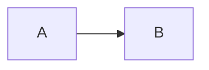

# scrawl

A web app for a folder of markdown files. Read and edit your notes from
a browser, on a laptop or a phone. One static binary, no database: the
files on disk are the only state.

- full text search, with a command palette on `Ctrl`/`Cmd` + `K`
- an editor with live preview, on desktop and on mobile
- create, rename and delete pages, paste images straight into the editor
- a version history per page: what changed, by whom, and a restore
- several projects at once, each a folder or a git remote it clones,
  serves and pushes back to
- a login page, users configured through the environment
- a JSON API with token auth, for scripts and agents
- light and dark themes
- installs to a phone home screen and runs there without browser chrome


## Try it

```
docker compose up
```

Open http://localhost:7272 and sign in as `admin` / `admin`. It serves
the sample notes from `examples/data`, so anything you edit changes
those files.

## Install it

Docker is the usual way to run it:

```
docker run -d --name scrawl \
  -p 7272:7272 \
  -v /path/to/notes:/notes \
  -v scrawl-data:/data \
  -e PROJECT=notes \
  -e AUTH_USERS='alex:my-password' \
  ghcr.io/aleksey925/scrawl:latest
```

`PROJECT` names the folder you are serving, and it is required. It is
the one segment every URL of that folder is served under -
`/p/notes/doc/python/redis.md` - so it is written down rather than
derived: a name taken from the directory would turn one `mv` into a
site-wide URL change.

A plain password works and the server warns about it on startup. For
anything reachable from outside, use a hash instead:

```
printf 'my-password' | docker run --rm -i ghcr.io/aleksey925/scrawl:latest --gen-hash
```

[examples/docker-compose.yml](examples/docker-compose.yml) is a fuller
deployment example. One thing there is worth knowing in advance: the
image runs as uid 1001, and if your notes folder belongs to a different
user, reading works and every save fails. The startup log says so, and
the `user:` line fixes it.

Without docker, unpack the latest
[release](https://github.com/aleksey925/scrawl/releases) archive into
`~/.local/bin`:

```
VERSION=$(curl -sL -o /dev/null -w '%{url_effective}' https://github.com/aleksey925/scrawl/releases/latest | sed 's/.*\/v//')
OS=$(uname -s | tr '[:upper:]' '[:lower:]')
ARCH=$(uname -m | sed 's/x86_64/amd64/;s/aarch64/arm64/')
curl -#L "https://github.com/aleksey925/scrawl/releases/download/v${VERSION}/scrawl_${VERSION}_${OS}_${ARCH}.tar.gz" | tar xz -C ~/.local/bin scrawl
```

or build it yourself with `go install github.com/aleksey925/scrawl@latest`.
A binary defaults to `/notes` and `:7272`, so point it at your own folder:

```
scrawl --root ~/notes --project notes --auth.users 'alex:my-password'
```

## Projects

A project is one folder, served under `/p/<name>/`. One is the normal
case and needs no configuration file: `--root` says where the notes are
and `--project` says what to call them.

For several, write them down instead. `--config` replaces `--root` and
`--project`; every other setting stays global.

```yaml
projects:
  - name: notes
    label: Personal notes
    dir: /notes

  - name: team
    label: Team wiki
    dir: /data/team
    read_only: true
    exclude: ["drafts/*"]
```

```
docker run -d --name scrawl -p 7272:7272 \
  -v ./scrawl.yml:/etc/scrawl.yml -v /path/to/notes:/notes -v team:/data/team \
  -e CONFIG=/etc/scrawl.yml \
  -e AUTH_USERS='alex:my-password' \
  ghcr.io/aleksey925/scrawl:latest
```

A misspelled key is a startup error rather than a setting that silently
did nothing. `read_only` only ever adds: a server started with
`READ_ONLY` refuses every write everywhere, and `read_only: false` on a
project cannot open it back up. `exclude` merges with the global
`EXCLUDE` for the same reason.

`/` redirects to the first project, and the topbar shows a switcher once
there is more than one. Everything else is shared: one login, one
session, one set of API tokens, and a search that searches the project
you are in.

For strict isolation between projects - separate credentials, separate
processes - run one scrawl per folder behind a reverse proxy instead.
That is what this feature deliberately does not do.

## Git remotes

A project may be a git repository rather than a plain folder. scrawl
clones it, serves it, and pushes back what you edit.

```yaml
projects:
  - name: team
    label: Team wiki
    dir: /data/team
    repo:
      url: https://github.com/acme/wiki.git
      branch: main
      token_file: /run/secrets/gh-token
      pull: 5m
```

With one project the same thing is three flags and one variable:

```
docker run -d --name scrawl -p 7272:7272 -v team:/data/team \
  -e PROJECT=team -e ROOT=/data/team \
  -e REPO_URL=https://github.com/acme/wiki.git \
  -e REPO_BRANCH=main \
  -e REPO_TOKEN='Bearer ghp_xxx' \
  -e AUTH_USERS='alex:my-password' \
  ghcr.io/aleksey925/scrawl:latest
```

**`dir` is a volume, and it has to survive a restart.** The clone lives
there and so does every commit that has not been pushed yet. If the
directory is inside the container's own filesystem, a restart re-clones
and anything the remote never got is gone.

**A credential is named, never written down inline.** `token_file`
points at a file, `token_env` at an environment variable, and the flag
path reads the fixed `REPO_TOKEN`. Setting both `token_file` and
`token_env` is a startup error rather than a precedence rule to
remember. The value is a whole header - `Bearer ghp_...` or
`Basic <base64>` - which keeps scrawl out of any per-provider encoding
rule. A URL carrying a password is refused: `git clone` writes the URL
into `.git/config`, where it would sit in plain text inside the notes
volume.

A mounted file is the better option wherever a secret store can provide
one. `token_env` and `REPO_TOKEN` are for the deployment that has none,
and it is worth knowing what an environment variable is visible to:
`docker inspect`, `docker compose config`, the systemd unit and the
shell history of whoever typed the command all keep the value. scrawl
unsets the variable as soon as it has read it, which stops it reaching
the git children and does nothing at all about any of those.

For ssh there is no setting: an ssh remote uses the agent and the
`~/.ssh` you mount into the container, like every other tool on the box.

**Pulling and pushing.** A save is committed and pushed straight away.
In between, `pull` says how often to fetch; `0` turns the ticker off,
and the startup fetch still happens. A fetch is followed by a
fast-forward and nothing else: scrawl never merges, never rebases and
never resolves. If the branch has diverged, the project keeps serving,
saves keep landing on disk and in local commits, and a banner says so on
every screen together with the command to run in the clone.

**Two things are worth knowing.** History is always on for a remote
project, whatever `HISTORY` says: one that stopped recording would also
stop pushing. And git cannot represent an empty directory, so a folder
you create reaches the remote with the first note you put in it.

A read-only remote never writes to git at all: it fetches and
fast-forwards, and it does not commit, push or probe.

## Configuration

Environment variables, each also available as a flag. Run
`scrawl --help` for the rest, including the HTTP timeouts.

| variable           | default             | meaning                                                                               |
| ------------------ | ------------------- | ------------------------------------------------------------------------------------- |
| `ROOT`             | `/notes`            | directory to serve                                                                    |
| `PROJECT`          |                     | name of that directory, required, the URL segment it gets                             |
| `CONFIG`           |                     | yaml file of projects, replaces `ROOT` and `PROJECT`                                  |
| `REPO_URL`         |                     | git remote to clone into `ROOT` and push back to                                      |
| `REPO_BRANCH`      | `main`              | branch to track                                                                       |
| `REPO_PULL`        | `5m`                | how often to fetch, `0` disables the background pull                                  |
| `REPO_TOKEN`       |                     | credential header for `REPO_URL`, i.e. `Bearer ghp_...`                               |
| `LISTEN`           | `:7272`             | address to listen on                                                                  |
| `TITLE`            | `Notes`             | site title in the interface                                                           |
| `AUTH_USERS`       |                     | `user:hashOrPassword`, comma separated                                                |
| `AUTH_TOKENS`      |                     | API tokens, `name:hashOrToken[:ro]`, comma separated                                  |
| `AUTH_SECRET`      |                     | cookie signing key, generated if empty                                                |
| `AUTH_SECRET_FILE` | `/data/session.key` | where a generated key is kept                                                         |
| `AUTH_TTL`         | `720h`              | how long a session lasts                                                              |
| `AUTH_SECURE`      | `auto`              | `Secure` flag of the session cookie                                                   |
| `AUTH_DISABLED`    | `false`             | serve without authentication                                                          |
| `READ_ONLY`        | `false`             | refuse every write                                                                    |
| `EXCLUDE`          |                     | extra ignore globs, comma separated                                                   |
| `MAX_UPLOAD`       | `20M`               | upload size cap                                                                       |
| `UPLOAD_DIR`       |                     | one shared folder for uploads                                                         |
| `WATCH`            | `auto`              | `poll` when the root is a network share                                               |
| `RESCAN`           | `60s`               | periodic rescan, negative disables it unless `WATCH=poll`                             |
| `HISTORY`          | `auto`              | keep a git history of changes, `on` fails without git, always on for a remote project |
| `TRUSTED_PROXY`    | `false`             | trust `X-Forwarded-For` and `-Proto`                                                  |
| `TZ`               | `UTC`               | timezone                                                                              |
| `DEBUG`            | `false`             | debug logging                                                                         |

Dot directories, `node_modules` and `__pycache__` are ignored, so notes
kept in git do not expose `.git`.

Behind a proxy that terminates TLS, set `TRUSTED_PROXY=true` and
`AUTH_SECURE=always`. The proxy must overwrite `X-Forwarded-For`,
otherwise a client can pick its own login rate limit bucket.

## Markdown

Pages render the way GitHub renders them: tables, task lists, footnotes,
alerts, emoji shortcodes, math, mermaid diagrams, `<details>` sections
and syntax highlighting.

````
> [!WARNING]
> This is an alert.

A footnote reference[^1] and a diagram:



[^1]: The footnote text.
````

Relative links between pages, in-page anchors and images from sibling
folders all keep working, and headings get anchors that handle Cyrillic.
Pasted images land in a folder next to the document and named after it,
so `python/notes.md` gets `python/notes/`. `UPLOAD_DIR` collects them in
one folder instead.

## Editing

- a save writes a temporary file and renames it into place, so a crash
  cannot leave half a document behind
- trailing whitespace is never trimmed, in markdown it can be meaningful
- if the file changed on disk since the editor opened it, the save is
  refused and you are shown both versions
- nothing outside the root is reachable and symbolic links are ignored

## API

A script or an agent uses the same JSON API the browser uses, with a
token instead of a login: no login form, no cookie jar, no CSRF header.
Generate a token:

```
scrawl --gen-token=bot
```

```
token, hand this to the client: scrawl_L5Y6q1vjgguEiF8ODvE_LLBABLm339BGlpPq4VSXBcg
configuration entry for --auth.tokens: bot:sha256:d84ee1b2b0037389726bc5b846778a2a03449050e7b1b06370e10995345cf1ce
```

The token is printed once and never stored; the configuration holds only
its digest. Put the entry in `AUTH_TOKENS`, comma separated like
`AUTH_USERS`, and give the token to the client:

```
AUTH_TOKENS='bot:sha256:d84ee1b2...,reader:sha256:7bc27e33...:ro'
```

`AUTH_USERS` may then be left empty: a headless deployment needs no
browser user. A plain secret in place of the digest also works and is
warned about at startup, exactly like a plain password.

Every request carries the token in a header. A wrong one is answered
with `401 {"error":"unauthorized"}` on every path, never a redirect to
the login page.

Every endpoint that reads or writes notes lives under the project that
holds them, `/p/<project>/api/...`. The handful that read no notes -
`/api/login`, `/api/logout`, `/api/projects` - answer at the root, and
`GET /api/projects` is what lists the names to put in the other URLs.

```
TOKEN=scrawl_L5Y6q1vjgguEiF8ODvE_LLBABLm339BGlpPq4VSXBcg
curl -sH "Authorization: Bearer $TOKEN" http://localhost:7272/api/projects
curl -sH "Authorization: Bearer $TOKEN" http://localhost:7272/p/notes/api/tree
curl -sH "Authorization: Bearer $TOKEN" 'http://localhost:7272/p/notes/api/search?q=redis'
curl -sH "Authorization: Bearer $TOKEN" http://localhost:7272/p/notes/api/file/python/notes.md
```

The last one answers with the source and the revision it was read at:

```json
{
  "path": "python/notes.md",
  "content": "# Notes\n",
  "rev": "sha256:6c8...",
  "size": 8,
  "mod_time": "2026-02-01T10:00:00Z"
}
```

Only text within the editable size cap comes back that way; anything
else answers `415` or `413` and is fetched from
`/p/<project>/raw/<path>`, which takes the same header.

A write sends that `rev` back, which is how the server tells that the
file did not move on in between. Read it, then save:

```
BASE=http://localhost:7272/p/notes
REV=$(curl -sH "Authorization: Bearer $TOKEN" $BASE/api/file/python/notes.md | jq -r .rev)
curl -s -X PUT -H "Authorization: Bearer $TOKEN" -H 'Content-Type: application/json' \
  -d '{"content":"# Notes\n\nredis notes\n","rev":"'"$REV"'"}' \
  $BASE/api/file/python/notes.md
```

The reply is `{"rev":"sha256:...","mod_time":"...","history_degraded":
false,"unpublished":false}`, and that `rev` is the one to send with the
next save, so a series of writes never has to re-read the file. An empty
`rev` means "create", and succeeds only while the path is still free.

The last two fields are on every write, and they are two different
failures. `history_degraded` says the change is on disk and not in git.
`unpublished` says it is in git and not on the remote. A browser save
gets them as a warning and keeps going; a token gets a `500` instead,
because an agent must never be told a change landed somewhere it did
not:

- `500 {"error":"the change was written but not recorded in history"}`
- `500 {"error":"the change was written and recorded, but not pushed to
the remote"}`

Both retry themselves: the next commit folds in what was missed, and
every push and every fetch tries again.

Two answers mean the file on disk is not what the client assumed. Both
carry `current_rev` and `current_content`, so a retry needs no second
request:

- `412 {"error":"conflict",...}` - somebody else wrote the file since
  the `rev` was read. Re-apply the change on top of `current_content`
  and send it back with `current_rev`.
- `409 {"error":"already exists",...}` - an empty `rev` was sent for a
  path that already exists. Send `current_rev` to overwrite it, or pick
  another path.

The rest of the write endpoints take no revision:

| request                             | body                            | answer                    |
| ----------------------------------- | ------------------------------- | ------------------------- |
| `POST /api/file/<path>`             | `{"type":"file"}` or `"dir"`    | `201 {"path":...}`        |
| `DELETE /api/file/<path>`           |                                 | `200 {"path":...}`        |
| `POST /api/move`                    | `{"from":"a.md","to":"b/a.md"}` | `200 {"path":...}`        |
| `POST /api/upload/<dir>?doc=<path>` | multipart `file`                | `201 {"path","markdown"}` |

Each is under `/p/<project>/`, and each carries `history_degraded` and
`unpublished` beside what the table shows.

A token ending in `:ro` reads everything and writes nothing: every write
is `403 {"error":"read-only token, writing is disabled"}`. `READ_ONLY`
on the server refuses the same writes for every token, read-write ones
included, and `read_only: true` on one project refuses them there.
All three say something different, so a client can tell whether asking
for a wider token would help.

## Development

The toolchain comes from `mise.toml`, so
[mise](https://mise.jdx.dev/getting-started.html) is the only thing to
install by hand:

```
mise install
make deps
```

```
make ui         build the interface into server/assets/app/
make build      build the binary into dist/
make run        run ./examples/data as the "notes" project, no authentication
make test       tests
make race       tests with the race detector
make cover      race tests plus a coverage summary
make lint       every hook: formatting, go vet, golangci-lint
make e2e        the browser suite
make img        build the image
```

The interface is a react app in [web/](web/), see
[web/README.md](web/README.md). What vite builds is committed under
`server/assets/app/` and embedded with `//go:embed`, which is what lets
`go install` and the docker image work with neither node nor the
network. Change anything under `web/` and the rebuilt bundle belongs in
the same commit: CI rebuilds it and fails if what is checked in is
stale.

Browser tests live in [e2e/](e2e/), see [e2e/README.md](e2e/README.md).
