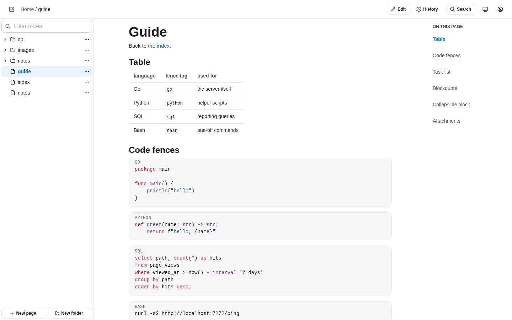
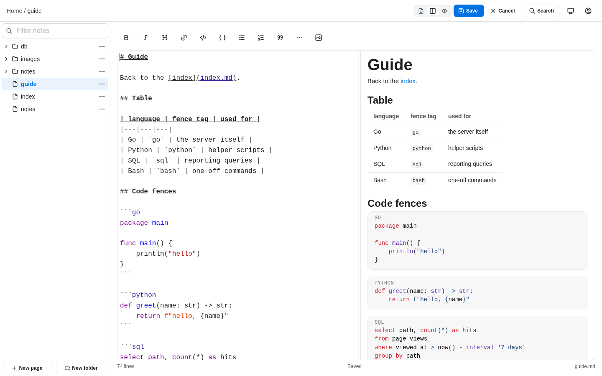
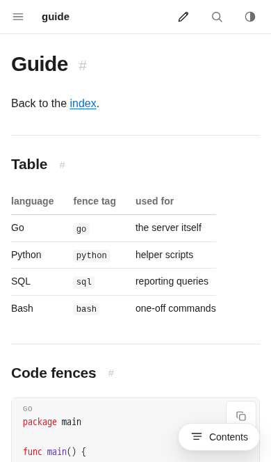

# scrawl

A web app for a folder of markdown files. Read and edit your notes from
a browser, on a laptop or a phone. One static binary, no database: the
files on disk are the only state.

- full text search, with a command palette on `Ctrl`/`Cmd` + `K`
- an editor with live preview, on desktop and on mobile
- create, rename and delete pages, paste images straight into the editor
- a version history per page: what changed, by whom, and a restore
- a login page, users configured through the environment
- a JSON API with token auth, for scripts and agents
- light and dark themes
- installs to a phone home screen and runs there without browser chrome







## Try it

```
docker compose up
```

Open http://localhost:7272 and sign in as `admin` / `admin`. It serves
the sample notes from `examples/data`, so anything you edit changes
those files.

## Install it

Docker is the usual way to run it:

```
docker run -d --name scrawl \
  -p 7272:7272 \
  -v /path/to/notes:/notes \
  -v scrawl-data:/data \
  -e AUTH_USERS='alex:my-password' \
  ghcr.io/aleksey925/scrawl:latest
```

A plain password works and the server warns about it on startup. For
anything reachable from outside, use a hash instead:

```
printf 'my-password' | docker run --rm -i ghcr.io/aleksey925/scrawl:latest --gen-hash
```

[examples/docker-compose.yml](examples/docker-compose.yml) is a fuller
deployment example. One thing there is worth knowing in advance: the
image runs as uid 1001, and if your notes folder belongs to a different
user, reading works and every save fails. The startup log says so, and
the `user:` line fixes it.

Without docker, unpack the latest
[release](https://github.com/aleksey925/scrawl/releases) archive into
`~/.local/bin`:

```
VERSION=$(curl -sL -o /dev/null -w '%{url_effective}' https://github.com/aleksey925/scrawl/releases/latest | sed 's/.*\/v//')
OS=$(uname -s | tr '[:upper:]' '[:lower:]')
ARCH=$(uname -m | sed 's/x86_64/amd64/;s/aarch64/arm64/')
curl -#L "https://github.com/aleksey925/scrawl/releases/download/v${VERSION}/scrawl_${VERSION}_${OS}_${ARCH}.tar.gz" | tar xz -C ~/.local/bin scrawl
```

or build it yourself with `go install github.com/aleksey925/scrawl@latest`.
A binary defaults to `/notes` and `:7272`, so point it at your own folder:

```
scrawl --root ~/notes --auth.users 'alex:my-password'
```

## Configuration

Environment variables, each also available as a flag. Run
`scrawl --help` for the rest, including the HTTP timeouts.

| variable           | default             | meaning                                                   |
| ------------------ | ------------------- | --------------------------------------------------------- |
| `ROOT`             | `/notes`            | directory to serve                                        |
| `LISTEN`           | `:7272`             | address to listen on                                      |
| `TITLE`            | `Notes`             | site title in the interface                               |
| `AUTH_USERS`       |                     | `user:hashOrPassword`, comma separated                    |
| `AUTH_TOKENS`      |                     | API tokens, `name:hashOrToken[:ro]`, comma separated      |
| `AUTH_SECRET`      |                     | cookie signing key, generated if empty                    |
| `AUTH_SECRET_FILE` | `/data/session.key` | where a generated key is kept                             |
| `AUTH_TTL`         | `720h`              | how long a session lasts                                  |
| `AUTH_SECURE`      | `auto`              | `Secure` flag of the session cookie                       |
| `AUTH_DISABLED`    | `false`             | serve without authentication                              |
| `READ_ONLY`        | `false`             | refuse every write                                        |
| `EXCLUDE`          |                     | extra ignore globs, comma separated                       |
| `MAX_UPLOAD`       | `20M`               | upload size cap                                           |
| `UPLOAD_DIR`       |                     | one shared folder for uploads                             |
| `WATCH`            | `auto`              | `poll` when the root is a network share                   |
| `RESCAN`           | `60s`               | periodic rescan, negative disables it unless `WATCH=poll` |
| `HISTORY`          | `auto`              | keep a git history of changes, `on` fails without git     |
| `TRUSTED_PROXY`    | `false`             | trust `X-Forwarded-For` and `-Proto`                      |
| `TZ`               | `UTC`               | timezone                                                  |
| `DEBUG`            | `false`             | debug logging                                             |

Dot directories, `node_modules` and `__pycache__` are ignored, so notes
kept in git do not expose `.git`.

Behind a proxy that terminates TLS, set `TRUSTED_PROXY=true` and
`AUTH_SECURE=always`. The proxy must overwrite `X-Forwarded-For`,
otherwise a client can pick its own login rate limit bucket.

## Markdown

Pages render the way GitHub renders them: tables, task lists, footnotes,
alerts, emoji shortcodes, math, mermaid diagrams, `<details>` sections
and syntax highlighting.

````
> [!WARNING]
> This is an alert.

A footnote reference[^1] and a diagram:


[^1]: The footnote text.
````

Relative links between pages, in-page anchors and images from sibling
folders all keep working, and headings get anchors that handle Cyrillic.
Pasted images land in a folder next to the document and named after it,
so `python/notes.md` gets `python/notes/`. `UPLOAD_DIR` collects them in
one folder instead.

## Editing

- a save writes a temporary file and renames it into place, so a crash
  cannot leave half a document behind
- trailing whitespace is never trimmed, in markdown it can be meaningful
- if the file changed on disk since the editor opened it, the save is
  refused and you are shown both versions
- nothing outside the root is reachable and symbolic links are ignored

## API

A script or an agent uses the same JSON API the browser uses, with a
token instead of a login: no login form, no cookie jar, no CSRF header.
Generate a token:

```
scrawl --gen-token=bot
```

```
token, hand this to the client: scrawl_L5Y6q1vjgguEiF8ODvE_LLBABLm339BGlpPq4VSXBcg
configuration entry for --auth.tokens: bot:sha256:d84ee1b2b0037389726bc5b846778a2a03449050e7b1b06370e10995345cf1ce
```

The token is printed once and never stored; the configuration holds only
its digest. Put the entry in `AUTH_TOKENS`, comma separated like
`AUTH_USERS`, and give the token to the client:

```
AUTH_TOKENS='bot:sha256:d84ee1b2...,reader:sha256:7bc27e33...:ro'
```

`AUTH_USERS` may then be left empty: a headless deployment needs no
browser user. A plain secret in place of the digest also works and is
warned about at startup, exactly like a plain password.

Every request carries the token in a header. A wrong one is answered
with `401 {"error":"unauthorized"}` on every path, never a redirect to
the login page:

```
TOKEN=scrawl_L5Y6q1vjgguEiF8ODvE_LLBABLm339BGlpPq4VSXBcg
curl -sH "Authorization: Bearer $TOKEN" http://localhost:7272/api/tree
curl -sH "Authorization: Bearer $TOKEN" 'http://localhost:7272/api/search?q=redis'
curl -sH "Authorization: Bearer $TOKEN" http://localhost:7272/api/file/python/notes.md
```

The last one answers with the source and the revision it was read at:

```json
{
  "path": "python/notes.md",
  "content": "# Notes\n",
  "rev": "sha256:6c8...",
  "size": 8,
  "mod_time": "2026-02-01T10:00:00Z"
}
```

Only text within the editable size cap comes back that way; anything
else answers `415` or `413` and is fetched from `/raw/<path>`, which
takes the same header.

A write sends that `rev` back, which is how the server tells that the
file did not move on in between. Read it, then save:

```
REV=$(curl -sH "Authorization: Bearer $TOKEN" http://localhost:7272/api/file/python/notes.md | jq -r .rev)
curl -s -X PUT -H "Authorization: Bearer $TOKEN" -H 'Content-Type: application/json' \
  -d '{"content":"# Notes\n\nredis notes\n","rev":"'"$REV"'"}' \
  http://localhost:7272/api/file/python/notes.md
```

The reply is `{"rev":"sha256:...","mod_time":"..."}`, and that `rev` is
the one to send with the next save, so a series of writes never has to
re-read the file. An empty `rev` means "create", and succeeds only while
the path is still free.

Two answers mean the file on disk is not what the client assumed. Both
carry `current_rev` and `current_content`, so a retry needs no second
request:

- `412 {"error":"conflict",...}` - somebody else wrote the file since
  the `rev` was read. Re-apply the change on top of `current_content`
  and send it back with `current_rev`.
- `409 {"error":"already exists",...}` - an empty `rev` was sent for a
  path that already exists. Send `current_rev` to overwrite it, or pick
  another path.

The rest of the write endpoints take no revision:

| request                             | body                            | answer                    |
| ----------------------------------- | ------------------------------- | ------------------------- |
| `POST /api/file/<path>`             | `{"type":"file"}` or `"dir"`    | `201 {"path":...}`        |
| `DELETE /api/file/<path>`           |                                 | `204`                     |
| `POST /api/move`                    | `{"from":"a.md","to":"b/a.md"}` | `200 {"path":...}`        |
| `POST /api/upload/<dir>?doc=<path>` | multipart `file`                | `201 {"path","markdown"}` |

A token ending in `:ro` reads everything and writes nothing: every write
is `403 {"error":"read-only token, writing is disabled"}`. `READ_ONLY`
on the server refuses the same writes for every token, read-write ones
included, and says `read-only mode` instead so the two are told apart.

## Development

The toolchain comes from `mise.toml`, so
[mise](https://mise.jdx.dev/getting-started.html) is the only thing to
install by hand:

```
mise install
make deps
```

```
make build      build the binary into dist/
make run        run against ./examples/data without authentication
make test       tests
make race       tests with the race detector
make cover      race tests plus a coverage summary
make lint       every hook: formatting, go vet, golangci-lint
make e2e        the browser suite
make img        build the image
```

Browser tests live in [e2e/](e2e/), see [e2e/README.md](e2e/README.md).
