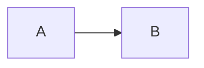

# scrawl

A knowledge base server for a folder of markdown files. Point it at a
directory, open it in a browser, read and edit your notes from a laptop
or a phone. One static binary, no database, no external services: the
files on disk are the only state.

Built to run in Docker on a NAS and to serve a knowledge base that is
also a git repository, so it never rewrites a file it was not asked to
change.

## What it does

- renders a directory of markdown as a browsable site, at any depth
- links between documents, images from the tree or from the web, and
  in-page anchors all keep working
- edits in the browser with a live preview, on desktop and on mobile
- full text search over the whole knowledge base, with a command
  palette on `Ctrl`/`Cmd` + `K`
- create, rename and delete pages and folders, and paste or drop images
  straight into the editor
- a login page with users configured through the environment
- light and dark themes

Markdown support matches GitHub: tables, task lists, footnotes, alerts
(`> [!NOTE]`), emoji shortcodes, math, mermaid diagrams, collapsed
sections and syntax highlighting. See [Markdown](#markdown) below.

## Try it locally

Builds from this checkout and serves `./notes`, no configuration:

```
mkdir -p notes
docker compose up --build
```

Open http://localhost:8080 and sign in as `admin` / `admin`. To browse a
knowledge base you already have, point `NOTES` at it:

```
NOTES=~/notes docker compose up --build
```

## Quick start

```
docker run -d --name scrawl \
  -p 8080:8080 \
  -v /path/to/knowledge-base:/notes \
  -v scrawl-data:/data \
  -e AUTH_USERS='alex:my-password' \
  ghcr.io/aleksey925/scrawl:master
```

Open http://localhost:8080 and sign in.

A plain password works and is fine on a home network, but the server
logs a warning. For anything reachable from outside, use a hash:

```
printf 'my-password' | docker run --rm -i ghcr.io/aleksey925/scrawl:master --gen-hash
```

Put the result in `AUTH_USERS` as `alex:$2a$10$...`. The password is
read from stdin so it stays out of `ps`, the shell history and
`docker inspect`.

## Synology

[example/docker-compose.yml](example/docker-compose.yml) is a ready
example with every decision explained. Copy it to the NAS, or paste it
into Container Manager under Project, and change three things:

1. the volume path, from `/volume1/docs/knowledge-base` to your share
2. `AUTH_USERS`
3. the `user:` line

The third one is what usually breaks a first run. The image runs as uid
1001, your share belongs to a DSM user, and a uid that does not own the
share cannot write to it: reading works and every save fails. Run
`id <your-dsm-user>` over ssh and put the numbers in `user:`. The
server also checks this at startup and says so in one warning line.

Note that in a compose file every literal `$` must be doubled, so a
hash printed as `$2a$10$xyz` is written `$$2a$$10$$xyz`. In Container
Manager's environment table values are taken literally, so paste the
hash unchanged.

## Configuration

Everything is configured through environment variables, and every one of
them except `TZ` is also a command line flag: `AUTH_USERS` is
`--auth.users`, `DEBUG` is `--dbg`. Run `scrawl --help` for the full
list, which also covers the HTTP timeouts left out of the table.

| variable           | default             | meaning                                                   |
| ------------------ | ------------------- | --------------------------------------------------------- |
| `ROOT`             | `/notes`            | knowledge base directory                                  |
| `LISTEN`           | `:8080`             | address to listen on                                      |
| `TITLE`            | `Knowledge Base`    | site title in the interface                               |
| `AUTH_USERS`       |                     | `user:hashOrPassword`, comma separated                    |
| `AUTH_SECRET`      |                     | cookie signing key, generated if empty                    |
| `AUTH_SECRET_FILE` | `/data/session.key` | where a generated key is kept                             |
| `AUTH_TTL`         | `720h`              | how long a session lasts                                  |
| `AUTH_SECURE`      | `auto`              | `Secure` flag of the session cookie                       |
| `AUTH_DISABLED`    | `false`             | serve without authentication                              |
| `READ_ONLY`        | `false`             | refuse every write                                        |
| `EXCLUDE`          |                     | extra ignore globs, comma separated                       |
| `MAX_UPLOAD`       | `20M`               | upload size cap                                           |
| `UPLOAD_DIR`       |                     | one shared folder for uploads                             |
| `WATCH`            | `auto`              | `poll` when the root is a network share                   |
| `RESCAN`           | `60s`               | periodic rescan, negative disables it unless `WATCH=poll` |
| `TRUSTED_PROXY`    | `false`             | trust `X-Forwarded-For` and `-Proto`                      |
| `TZ`               | `UTC`               | timezone                                                  |
| `DEBUG`            | `false`             | debug logging                                             |

Dot directories, `node_modules` and `__pycache__` are ignored, so a
knowledge base that is a git repository does not expose `.git`.

Behind a reverse proxy that terminates TLS, set `TRUSTED_PROXY=true`
and `AUTH_SECURE=always`. The proxy must overwrite `X-Forwarded-For`,
otherwise a client can pick its own login rate limit bucket.

## Markdown

Documents render the way GitHub renders them, including footnotes,
alerts, `<details>` sections, task lists, tables, emoji shortcodes,
math and mermaid diagrams:

````
> [!WARNING]
> This is an alert.

A footnote reference[^1] and a diagram:



[^1]: The footnote text.
````

Relative links between documents, in-page anchors and images from
sibling folders all keep working, and headings get anchors that handle
Cyrillic. Uploaded images land in a folder next to the document and
named after it, which is the layout a knowledge base usually already
has: `python/notes.md` gets `python/notes/`. Set `UPLOAD_DIR` to
collect them in one folder instead.

## How your files are treated

- a save writes to a temporary file and renames it into place, so a
  crash cannot leave a half written document
- the editor never trims trailing whitespace, because in markdown it is
  sometimes meaningful
- if a file changed on disk since the editor loaded it, the save is
  refused and you are shown both versions
- nothing outside the root is reachable, and symbolic links are ignored

## Development

```
make build      build the binary
make run        run against ./testdata/notes without authentication
make test       tests with the race detector
make lint       golangci-lint
make docker     build the image
```

Browser tests live in [e2e/](e2e/) and run against real binaries, see
[e2e/README.md](e2e/README.md).
