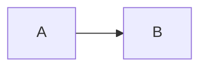

# scrawl

A web app for a folder of markdown files. Read and edit your notes from
a browser, on a laptop or a phone. One static binary, no database: the
files on disk are the only state.

- full text search, with a command palette on `Ctrl`/`Cmd` + `K`
- an editor with live preview, on desktop and on mobile
- pages and folders made in the tree itself, dragged between folders,
  renamed and deleted; paste images straight into the editor
- a version history per page: what changed, by whom, and a restore
- several spaces at once, each a folder or a git repository it clones,
  serves and pushes back to
- a login page, users configured through the environment
- a JSON API with token auth, for scripts and agents
- light and dark themes
- installs to a phone home screen and runs there without browser chrome

## Try it

```
docker compose up
```

Open http://localhost:7272 and sign in as `admin` / `admin`. It serves
the sample notes from `examples/data`, so anything you edit changes
those files.

## Install it

Docker is the usual way to run it:

```
docker run -d --name scrawl \
  -p 7272:7272 \
  -v /path/to/notes:/spaces/notes \
  -v scrawl-data:/data \
  -e SPACE_NAME=notes \
  -e AUTH_USERS='alex:my-password' \
  ghcr.io/aleksey925/scrawl:latest
```

The folder you serve is called a space. `SPACE_NAME` names it, and it is
required. It is the one segment every URL of that folder is served
under - `/s/notes/doc/python/redis.md` - so it is written down rather
than derived: a name taken from the directory would turn one `mv` into a
site-wide URL change.

A plain password works and the server warns about it on startup. For
anything reachable from outside, use a hash instead:

```
printf 'my-password' | docker run --rm -i ghcr.io/aleksey925/scrawl:latest --gen-hash
```

[examples/docker-compose.yml](examples/docker-compose.yml) is a fuller
deployment example. One thing there is worth knowing in advance: the
image runs as uid 1001, and if your notes folder belongs to a different
user, reading works and every save fails. The startup log says so, and
the `user:` line fixes it.

Without docker, unpack the latest
[release](https://github.com/aleksey925/scrawl/releases) archive into
`~/.local/bin`:

```
VERSION=$(curl -sL -o /dev/null -w '%{url_effective}' https://github.com/aleksey925/scrawl/releases/latest | sed 's/.*\/v//')
OS=$(uname -s | tr '[:upper:]' '[:lower:]')
ARCH=$(uname -m | sed 's/x86_64/amd64/;s/aarch64/arm64/')
curl -#L "https://github.com/aleksey925/scrawl/releases/download/v${VERSION}/scrawl_${VERSION}_${OS}_${ARCH}.tar.gz" | tar xz -C ~/.local/bin scrawl
```

or build it yourself with `go install github.com/aleksey925/scrawl@latest`.
A binary defaults to `/spaces/notes` and `:7272`, so point it at your own
folder:

```
scrawl --space.dir ~/notes --space.name notes --auth.users 'alex:my-password'
```

## Configuration

A **space** is what scrawl serves: one folder of notes, or a git
repository cloned into one. Each space lives under `/s/<name>/` and has
its own tree, search and history.

There are two kinds of settings:

- **Server settings** describe the server itself. They are environment
  variables and they always apply.
- **Space settings** describe what is served. For one space they are
  environment variables too. For several spaces they go into a yaml
  file, and then the space variables are ignored.

Every variable is also a flag: `SITE_TITLE` is `--site-title`,
`AUTH_USERS` is `--auth.users`. Run `scrawl --help` for the full list,
including the HTTP timeouts.

### Server settings

These always apply, with a spaces file or without one. Only a way to
sign in is required, everything else has a working default.

| variable           | required              | default             | meaning                                                                                                                              |
| ------------------ | --------------------- | ------------------- | ------------------------------------------------------------------------------------------------------------------------------------ |
| `LISTEN`           |                       | `:7272`             | address to listen on                                                                                                                 |
| `SITE_TITLE`       |                       | `Notes`             | name of the site: the browser tab, the sign-in page, the home screen icon                                                            |
| `AUTH_USERS`       | yes, or `AUTH_TOKENS` |                     | who can sign in: `user:hashOrPassword`, comma separated                                                                              |
| `AUTH_TOKENS`      |                       |                     | API tokens for scripts and agents, `name:hashOrToken[:ro]`, comma separated; enough alone for a server no browser signs in to        |
| `AUTH_DISABLED`    |                       | `false`             | serve without authentication, then neither of the two above is needed                                                                |
| `AUTH_SECRET`      |                       |                     | cookie signing key; leave empty and one is generated and kept                                                                        |
| `AUTH_SECRET_FILE` |                       | `/data/session.key` | where a generated key is kept                                                                                                        |
| `AUTH_TTL`         |                       | `720h`              | how long a session lasts                                                                                                             |
| `AUTH_SECURE`      |                       | `auto`              | `Secure` flag of the session cookie; `always` behind an HTTPS proxy                                                                  |
| `READ_ONLY`        |                       | `false`             | refuse every write, in every space                                                                                                   |
| `EXCLUDE`          |                       |                     | extra ignore globs for every space, comma separated                                                                                  |
| `MAX_UPLOAD`       |                       | `20M`               | upload size cap                                                                                                                      |
| `UPLOAD_DIR`       |                       |                     | put every upload in this one folder instead of a folder next to the note                                                             |
| `WATCH`            |                       | `auto`              | set to `poll` when a space is on a network share                                                                                     |
| `RESCAN`           |                       | `60s`               | periodic rescan, negative disables it unless `WATCH=poll`                                                                            |
| `HISTORY`          |                       | `auto`              | keep a git history of changes; `on` fails without git, `off` never touches the notes; always on for a space that is a git repository |
| `TRUSTED_PROXY`    |                       | `false`             | trust `X-Forwarded-For` and `-Proto`; set it behind a reverse proxy                                                                  |
| `TZ`               |                       | `UTC`               | timezone                                                                                                                             |
| `DEBUG`            |                       | `false`             | debug logging                                                                                                                        |

Dot directories, `node_modules` and `__pycache__` are ignored, so notes
kept in git do not expose `.git`.

Behind a proxy that terminates TLS, set `TRUSTED_PROXY=true` and
`AUTH_SECURE=always`. The proxy must overwrite `X-Forwarded-For`,
otherwise a client can pick its own login rate limit bucket.

### One space

When you need to connect to only one space, you can describe all the
required configuration through environment variables without creating
a file with the space configuration.

**They are ignored when `SPACES_FILE` is set**, and the startup log
warns about each one that was set anyway. The last column is the key
that takes the variable's place in the file.

| variable     | required | default         | meaning                                    | in the file |
| ------------ | -------- | --------------- | ------------------------------------------ | ----------- |
| `SPACE_NAME` | yes      |                 | name of the space, the URL segment it gets | `name`      |
| `SPACE_DIR`  |          | `/spaces/notes` | directory to serve                         | `dir`       |

That is all a plain folder needs. The rest is only for a space that is
a git repository, see
[A git repository as a space](#a-git-repository-as-a-space). Leave all
of it out otherwise.

| variable           | required | default | meaning                                                                                                                    | in the file                                       |
| ------------------ | -------- | ------- | -------------------------------------------------------------------------------------------------------------------------- | ------------------------------------------------- |
| `REPO_URL`         | yes      |         | the remote: the repository to clone into `SPACE_DIR` and push back to; setting it is what makes the space a git repository | `repo.url`                                        |
| `REPO_BRANCH`      |          | `main`  | branch to track                                                                                                            | `repo.branch`                                     |
| `REPO_PULL`        |          | `5m`    | how often to fetch, `0` disables the background pull                                                                       | `repo.pull`                                       |
| `REPO_TOKEN`       |          |         | token for `REPO_URL`, or a whole `Authorization` header; leave it out for a public repository or an ssh remote             | `repo.token_file` or `repo.token_env`             |
| `REPO_HOOK_SECRET` |          |         | webhook secret, at least 32 bytes; set it only to let the git host trigger a fetch                                         | `repo.hook_secret_file` or `repo.hook_secret_env` |

### Several spaces

For more than one space, describe them in a yaml file and point
`SPACES_FILE` at it.

| variable      | required | default | meaning                                                                     |
| ------------- | -------- | ------- | --------------------------------------------------------------------------- |
| `SPACES_FILE` |          |         | path to the yaml file that lists spaces; set it only to serve more than one |

The file holds space settings and nothing else. Server settings stay in
the environment. Here is a file with every key there is:

```yaml
spaces:
  # a plain folder: name and dir are all it needs
  - name: notes
    label: Personal notes
    dir: /spaces/notes

  # a git repository: the repo block is what makes it one
  - name: team
    label: Team wiki
    dir: /spaces/team
    read_only: true
    exclude: ["drafts/*"]
    repo:
      url: https://github.com/acme/wiki.git
      branch: main
      pull: 5m
      token_file: /run/secrets/gh-token # or token_env: GH_TOKEN
      hook_secret_file: /run/secrets/gh-hook # or hook_secret_env: GH_HOOK
```

| key                     | required           | default  | meaning                                                                                                                        |
| ----------------------- | ------------------ | -------- | ------------------------------------------------------------------------------------------------------------------------------ |
| `name`                  | yes                |          | URL segment: lowercase letters, digits, `-` and `_`, unique                                                                    |
| `label`                 |                    | the name | what the switcher and the top of the tree show                                                                                 |
| `dir`                   | yes                |          | directory to serve                                                                                                             |
| `read_only`             |                    | `false`  | refuse every write in this space                                                                                               |
| `exclude`               |                    |          | extra ignore globs for this space, added to `EXCLUDE`                                                                          |
| `repo`                  |                    |          | add this block only for a space that is a git repository: `dir` becomes a clone of the remote; leave it out for a plain folder |
| `repo.url`              | yes, inside `repo` |          | the remote to clone and push back to                                                                                           |
| `repo.branch`           |                    | `main`   | branch to track                                                                                                                |
| `repo.pull`             |                    | `5m`     | how often to fetch, `0` disables the background pull                                                                           |
| `repo.token_file`       |                    |          | file holding the token for `repo.url`; no token at all for a public repository or an ssh remote                                |
| `repo.token_env`        |                    |          | variable holding that token, instead of `token_file`                                                                           |
| `repo.hook_secret_file` |                    |          | file holding the webhook secret; set it only to let the git host trigger a fetch                                               |
| `repo.hook_secret_env`  |                    |          | variable holding that secret, instead of `hook_secret_file`                                                                    |

```
docker run -d --name scrawl -p 7272:7272 \
  -v ./spaces.yml:/etc/spaces.yml -v /path/to/notes:/spaces/notes -v scrawl-spaces:/spaces \
  -e SPACES_FILE=/etc/spaces.yml \
  -e AUTH_USERS='alex:my-password' \
  ghcr.io/aleksey925/scrawl:latest
```

A few rules:

- A misspelled key is a startup error rather than a setting that
  silently did nothing.
- `read_only` only ever adds. A server started with `READ_ONLY` refuses
  every write everywhere, and `read_only: false` on a space cannot open
  it back up.
- `exclude` adds to the server-wide `EXCLUDE` for the same reason.
- Setting both `token_file` and `token_env`, or both hook secret keys,
  is a startup error rather than a precedence rule to remember.

`/` redirects to the first space, and the topbar shows a switcher once
there is more than one. Everything else is shared: one login, one
session, one set of API tokens, and a search that searches the space you
are in.

For strict isolation between spaces - separate credentials, separate
processes - run one scrawl per folder behind a reverse proxy instead.
That is what this feature deliberately does not do.

## A git repository as a space

A space may be a git repository rather than a plain folder. Give it the
address of the repository and scrawl clones it, serves it, and pushes
back what you edit. That repository, on the git host, is called the
remote below. In the file it is a `repo` block:

```yaml
spaces:
  - name: team
    dir: /spaces/team
    repo:
      url: https://github.com/acme/wiki.git
      token_file: /run/secrets/gh-token
```

With one space it is the `REPO_*` variables:

```
docker run -d --name scrawl -p 7272:7272 -v scrawl-spaces:/spaces \
  -e SPACE_NAME=team -e SPACE_DIR=/spaces/team \
  -e REPO_URL=https://github.com/acme/wiki.git \
  -e REPO_TOKEN='github_pat_xxx' \
  -e AUTH_USERS='alex:my-password' \
  ghcr.io/aleksey925/scrawl:latest
```

Every key and variable is listed under
[Configuration](#configuration). The rest of this section is about how such
a space behaves.

**The directory is a volume, and it has to survive a restart.** The
clone lives there and so does every commit that has not been pushed yet.
If the directory is inside the container's own filesystem, a restart
re-clones and anything the remote never got is gone.

The image keeps `/spaces` for this. It belongs to the user the image
runs as, so a named volume mounted there is writable from the first
start, and one volume holds every clone: `/spaces/team`,
`/spaces/wiki`. A volume mounted at a path the image does not have
belongs to root, and the clone fails with `permission denied`.

**A credential is named, never written down inline.** `token_file`
points at a file, `token_env` at an environment variable, and a single
space reads the fixed `REPO_TOKEN`. A URL carrying a password is
refused: `git clone` writes the URL into `.git/config`, where it would
sit in plain text inside the notes volume.

**The value is the token itself**, the string the git host handed you -
`github_pat_...`, `glpat-...` - and scrawl makes the HTTP credential out
of it. A value that already names a scheme is taken as a whole
`Authorization` header instead and passed through untouched, which is
what a host wanting something else needs: github.com accepts only
`Basic` on its git endpoint, Bitbucket Data Center only
`Bearer <token>`.

A mounted file is the better option wherever a secret store can provide
one. `token_env` and `REPO_TOKEN` are for the deployment that has none,
and it is worth knowing what an environment variable is visible to:
`docker inspect`, `docker compose config`, the systemd unit and the
shell history of whoever typed the command all keep the value. scrawl
unsets the variable as soon as it has read it, which stops it reaching
the git children and does nothing at all about any of those.

For ssh there is no setting: an ssh remote uses the agent and the
`~/.ssh` you mount into the container, like every other tool on the box.

**Pulling and pushing.** A save is committed and pushed straight away.
In between, `pull` says how often to fetch; `0` turns the ticker off,
and the startup fetch still happens. A fetch is followed by a
fast-forward and nothing else: scrawl never merges, never rebases and
never resolves. If the branch has diverged, the space keeps serving,
saves keep landing on disk and in local commits, and a banner says so on
every screen together with a button that resets this copy to the remote
version - see [below](#when-a-space-has-diverged).

**Two things are worth knowing.** History is always on for a space that
is a git repository, whatever `HISTORY` says: one that stopped recording
would also stop pushing. And git cannot represent an empty directory, so
a folder you create reaches the remote with the first note you put in
it.

A read-only space of this kind never writes to git at all: it fetches
and fast-forwards, and it does not commit, push or probe. A change that
appears in its directory some other way is served and read, and it is
never recorded: there is no push to carry that commit anywhere, and it
would be what the next fetch from the remote trips over.

## A webhook instead of polling

Give a space a hook secret and the git host can tell scrawl to fetch,
instead of scrawl asking every few minutes.

```yaml
spaces:
  - name: team
    dir: /spaces/team
    repo:
      url: https://github.com/acme/wiki.git
      pull: 1h
      hook_secret_file: /run/secrets/gh-hook # or hook_secret_env: HOOK
```

With one space it is `REPO_HOOK_SECRET`, the same fixed and optional
shape `REPO_TOKEN` has. Generate the secret rather than typing one:

```
openssl rand -hex 32
```

It has to be at least 32 bytes. The endpoint answers without a session -
a git host cannot sign in - so the signature is the only credential
there is, and a short one turns the route into a public "resync this
space" button. Naming a secret that turns out to hold nothing - an
empty file, a variable that never got a value - stops the server rather
than serving the space with its webhook quietly off, because a secret
that failed to mount looks exactly like that. The way to have no webhook
is to name no secret. The file has to live outside every space
directory, for the same reason the session key does: anything inside is
on the tree, in the search index and downloadable.

Paste this URL into the repository's webhook settings, with the content
type the git host offers by default:

```
https://notes.example.com/s/team/hook
```

Behind TLS, always. A signature proves the body was not tampered with
and hides nothing, and GitLab's scheme sends the secret itself.

GitHub, Gitea and Forgejo are verified by `X-Hub-Signature-256`, GitLab
by `X-Gitlab-Token`. Nothing has to be configured for that: the header
says which one the sender used. The old sha1 `X-Hub-Signature` is not
accepted.

**Keep a slow `pull` on.** `pull: 1h` with a hook means deliveries do
the work, almost every tick finds nothing, and a delivery that goes
missing costs an hour rather than lasting until the next restart.
Nothing detects a lost delivery: there is no ledger and no catch-up
request, so with `pull: 0` the clone simply stays behind.

The body is never read beyond verifying it. A delivery means "something
may have changed", so a push to a branch scrawl does not track costs one
fetch that finds nothing - which is cheaper than a parser that has to
know four git hosts' payloads. Deliveries also coalesce: twenty in a
second cause at most two fetches, because they all ask the same
question.

## When something is not reaching the remote

Nothing about this blocks you. The save landed, the note is on disk, the
history entry exists - the only thing that did not happen is the push,
and editing carries on exactly as before.

An amber control appears in the top bar and stays there. It says whether
the note you are looking at is one of the affected ones, and clicking it
lists them. A banner above the page explains the same thing in full and
carries the exact git reason. The two share their words: the banner
explains and scrolls away with the page, the control persists. On a
phone the control is an entry in the top bar's `⋯` menu, and an amber dot
on that menu stays in sight while the problem lasts.

The messages tell four things apart:

- **Changes are not reaching the remote.** The push failed. The next
  save tries again.
- **The remote does not take changes from this space.** The push was
  refused: the space has no token, or its token may not write there. A
  public repository is the usual case - it clones without a token and
  takes no push without one. No retry fixes it: give the space a token
  with write access, or set `read_only`.
- **The remote cannot be reached.** The fetch failed. This copy may be
  behind, and if you saved anything it has not gone out either.
- **This space has diverged from the remote.** Both sides hold
  commits the other lacks: somebody pushed while this copy had commits
  of its own, or the branch was rebased or force-pushed. scrawl does not
  merge: nothing is sent or received until the copy is reset, which the
  message offers as a button.
- **The remote version cannot be applied here.** The fetch worked and
  the fast-forward did not, for a reason that is not a divergence - a
  file left in the way, most often. The git reason is in the message.
- **Changes are not being recorded.** Not the remote at all: a commit
  failed, so a change is on disk and not in git. The next save that
  succeeds folds it in.

A first import of a large corpus can show "many files are affected"
once, until the first push lands. Past a couple of hundred files the
per-note markers stop and the message says so, because at that point the
answer is "the whole corpus" and a marker per note answers nothing.

The page refreshes this on its own, about once a minute and only while
the tab is in front of you, so a push that starts working again clears
the warning without a reload. A background refresh does not extend your
session: a tab left open would otherwise keep one alive forever.

### When a space has diverged

The banner and the top bar control carry one button, **Reset to the
remote version**. It makes this copy hold exactly what the remote holds,
and it asks first:

1. It fetches and checks what the reset would lose. The check is a trial
   merge and not a commit count, so after a rebase or a squash on the remote
   it says "nothing will be lost" when the content really is there.
   Otherwise it lists the notes that hold changes only this copy has.
2. If there is anything to lose, the copy is kept in a branch named
   `scrawl-backup/<date>-<time>-<commit>` before the reset. Whatever was
   on disk and not yet committed goes into it too.
3. A checkbox sends that branch to the remote as well, where you can
   open it on your git host and bring the changes back. It is on by
   default. Turn it off when the remote was rewritten to remove
   something for good, or the backup brings it back; the branch then
   stays in the clone on the server. If the push fails, nothing is
   reset.

The reset never writes over a file that is in no commit. A file git does
not track that stands where the remote has one of its own stops it, and
the message names the file.

Whoever can write can reset, and so can anybody signed in to a
read-only space: a read-only mirror whose remote was rebased is the
one that needs it most. A `:ro` token cannot, and neither can a reader
of a read-only space on a server with authentication off, where the
button would belong to anybody who can reach the page.

## Markdown

Pages render and look the way GitHub renders them: tables, task lists,
footnotes, alerts, emoji shortcodes, math, mermaid diagrams, `<details>`
sections and syntax highlighting. The styles are a port of GitHub's own
markdown stylesheet, in both the light and the dark theme.

````
> [!WARNING]
> This is an alert.

A footnote reference[^1] and a diagram:


```mermaid
graph LR; A --> B;
```

[^1]: The footnote text.
````

Relative links between pages, in-page anchors and images from sibling
folders all keep working, and headings get anchors that handle Cyrillic.
Pasted images land in a folder next to the document and named after it,
so `python/notes.md` gets `python/notes/`. `UPLOAD_DIR` collects them in
one folder instead.

## Editing

- a save writes a temporary file and renames it into place, so a crash
  cannot leave half a document behind
- trailing whitespace is never trimmed, in markdown it can be meaningful
- if the file changed on disk since the editor opened it, the save is
  refused and you are shown both versions
- nothing outside the folder of a space is reachable and symbolic links
  are ignored

## API

A script or an agent uses the same JSON API the browser uses, with a
token instead of a login: no login form, no cookie jar, no CSRF header.
Generate a token:

```
scrawl --gen-token=bot
```

```
token, hand this to the client: scrawl_L5Y6q1vjgguEiF8ODvE_LLBABLm339BGlpPq4VSXBcg
configuration entry for --auth.tokens: bot:sha256:d84ee1b2b0037389726bc5b846778a2a03449050e7b1b06370e10995345cf1ce
```

The token is printed once and never stored; the configuration holds only
its digest. Put the entry in `AUTH_TOKENS`, comma separated like
`AUTH_USERS`, and give the token to the client:

```
AUTH_TOKENS='bot:sha256:d84ee1b2...,reader:sha256:7bc27e33...:ro'
```

`AUTH_USERS` may then be left empty: a headless deployment needs no
browser user. A plain secret in place of the digest also works and is
warned about at startup, exactly like a plain password.

Every request carries the token in a header. A wrong one is answered
with `401 {"error":"unauthorized"}` on every path, never a redirect to
the login page.

Every endpoint that reads or writes notes lives under the space that
holds them, `/s/<space>/api/...`. The handful that read no notes -
`/api/login`, `/api/logout`, `/api/spaces` - answer at the root, and
`GET /api/spaces` is what lists the names to put in the other URLs.

```
TOKEN=scrawl_L5Y6q1vjgguEiF8ODvE_LLBABLm339BGlpPq4VSXBcg
curl -sH "Authorization: Bearer $TOKEN" http://localhost:7272/api/spaces
curl -sH "Authorization: Bearer $TOKEN" http://localhost:7272/s/notes/api/tree
curl -sH "Authorization: Bearer $TOKEN" 'http://localhost:7272/s/notes/api/search?q=redis'
curl -sH "Authorization: Bearer $TOKEN" http://localhost:7272/s/notes/api/file/python/notes.md
```

The last one answers with the source and the revision it was read at:

```json
{
  "path": "python/notes.md",
  "content": "# Notes\n",
  "rev": "sha256:6c8...",
  "size": 8,
  "mod_time": "2026-02-01T10:00:00Z"
}
```

Only text within the editable size cap comes back that way; anything
else answers `415` or `413` and is fetched from
`/s/<space>/raw/<path>`, which takes the same header.

A write sends that `rev` back, which is how the server tells that the
file did not move on in between. Read it, then save:

```
BASE=http://localhost:7272/s/notes
REV=$(curl -sH "Authorization: Bearer $TOKEN" $BASE/api/file/python/notes.md | jq -r .rev)
curl -s -X PUT -H "Authorization: Bearer $TOKEN" -H 'Content-Type: application/json' \
  -d '{"content":"# Notes\n\nredis notes\n","rev":"'"$REV"'"}' \
  $BASE/api/file/python/notes.md
```

The reply is `{"rev":"sha256:...","mod_time":"...","history_degraded":
false,"unpublished":false}`, and that `rev` is the one to send with the
next save, so a series of writes never has to re-read the file. An empty
`rev` means "create", and succeeds only while the path is still free.

The last two fields are on every write, and they are two different
failures. `history_degraded` says the change is on disk and not in git.
`unpublished` says it is in git and not on the remote. A browser save
gets them as a warning and keeps going; a token gets a `500` instead,
because an agent must never be told a change landed somewhere it did
not:

- `500 {"error":"the change was written but not recorded in history"}`
- `500 {"error":"the change was written and recorded, but not pushed to
the remote"}`

Both retry themselves: the next commit folds in what was missed, and
every push and every fetch tries again.

Two answers mean the file on disk is not what the client assumed. Both
carry `current_rev` and `current_content`, so a retry needs no second
request:

- `412 {"error":"conflict",...}` - somebody else wrote the file since
  the `rev` was read. Re-apply the change on top of `current_content`
  and send it back with `current_rev`.
- `409 {"error":"already exists",...}` - an empty `rev` was sent for a
  path that already exists. Send `current_rev` to overwrite it, or pick
  another path.

The rest of the write endpoints take no revision:

| request                             | body                            | answer                    |
| ----------------------------------- | ------------------------------- | ------------------------- |
| `POST /api/file/<path>`             | `{"type":"file"}` or `"dir"`    | `201 {"path":...}`        |
| `DELETE /api/file/<path>`           |                                 | `200 {"path":...}`        |
| `POST /api/move`                    | `{"from":"a.md","to":"b/a.md"}` | `200 {"path":...}`        |
| `POST /api/upload/<dir>?doc=<path>` | multipart `file`                | `201 {"path","markdown"}` |

Each is under `/s/<space>/`, and each carries `history_degraded` and
`unpublished` beside what the table shows.

A token ending in `:ro` reads everything and writes nothing: every write
is `403 {"error":"read-only token, writing is disabled"}`. `READ_ONLY`
on the server refuses the same writes for every token, read-write ones
included, and `read_only: true` on one space refuses them there.
All three say something different, so a client can tell whether asking
for a wider token would help.

## Development

The toolchain comes from `mise.toml`, so
[mise](https://mise.jdx.dev/getting-started.html) is the only thing to
install by hand:

```
mise install
make deps
```

`make deps` sets up the whole working checkout: the go modules, the
node modules of the interface and of the browser suite, and the
Chromium the suite drives. Run it again after pulling a change to any
lockfile; a Playwright bump wants a new browser, and without it every
browser test fails with "Executable doesn't exist".

```
make ui         build the interface into server/assets/app/
make build      build the binary into dist/
make run        run ./examples/data as the "notes" space, no authentication
make test       tests
make race       tests with the race detector
make cover      race tests plus a coverage summary
make lint       every hook: formatting, go vet, golangci-lint
make e2e        the browser suite
make img        build the image
```

The interface is a react app in [web/](web/), see
[web/README.md](web/README.md). What vite builds is committed under
`server/assets/app/` and embedded with `//go:embed`, which is what lets
`go install` and the docker image work with neither node nor the
network. Change anything under `web/` and the rebuilt bundle belongs in
the same commit: CI rebuilds it and fails if what is checked in is
stale.

Browser tests live in [e2e/](e2e/), see [e2e/README.md](e2e/README.md).
