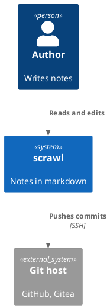
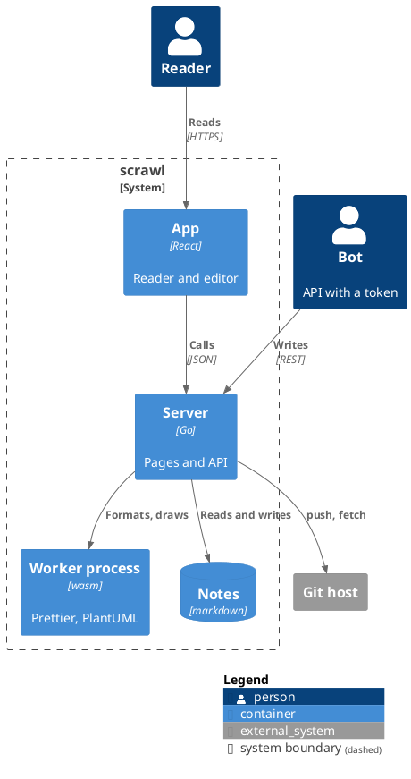
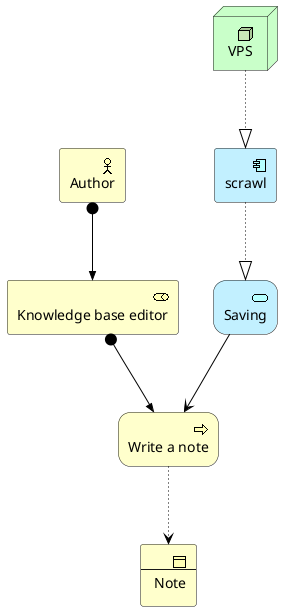

# Architecture

Diagrams from PlantUML's standard library. A library is loaded only
when a diagram includes it.

## C4

Context, small:

```plantuml
@startuml
!include <C4/C4_Context>
Person(author, "Author", "Writes notes")
System(scrawl, "scrawl", "Notes in markdown")
System_Ext(git, "Git host", "GitHub, Gitea")
Rel(author, scrawl, "Reads and edits")
Rel(scrawl, git, "Pushes commits", "SSH")
@enduml
```

Containers, medium, with a legend:

```plantuml
@startuml
!include <C4/C4_Container>
Person(reader, "Reader")
Person(bot, "Bot", "API with a token")
System_Boundary(scrawl, "scrawl") {
  Container(spa, "App", "React", "Reader and editor")
  Container(api, "Server", "Go", "Pages and API")
  Container(worker, "Worker process", "wasm", "Prettier, PlantUML")
  ContainerDb(files, "Notes", "markdown")
}
System_Ext(git, "Git host")
Rel(reader, spa, "Reads", "HTTPS")
Rel(bot, api, "Writes", "REST")
Rel(spa, api, "Calls", "JSON")
Rel(api, worker, "Formats, draws")
Rel(api, files, "Reads and writes")
Rel(api, git, "push, fetch")
SHOW_LEGEND()
@enduml
```

## ArchiMate

```plantuml
@startuml
!include <archimate/Archimate>
Business_Actor(author, "Author")
Business_Role(editor, "Knowledge base editor")
Business_Process(write, "Write a note")
Business_Object(note, "Note")
Application_Component(scrawl, "scrawl")
Application_Service(save, "Saving")
Technology_Node(vps, "VPS")
Rel_Assignment(author, editor)
Rel_Assignment(editor, write)
Rel_Access_w(write, note)
Rel_Serving(save, write)
Rel_Realization(scrawl, save)
Rel_Realization(vps, scrawl)
@enduml
```
