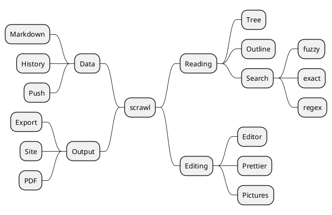
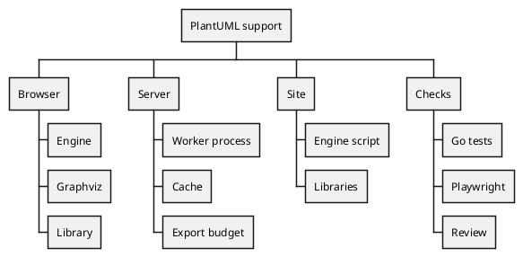
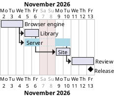
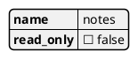
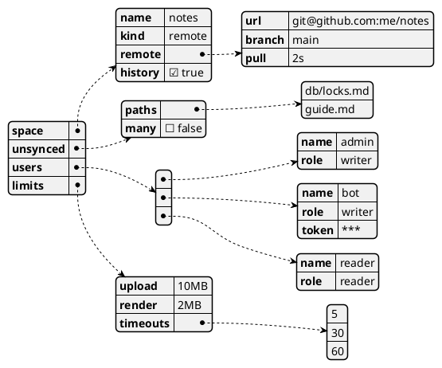
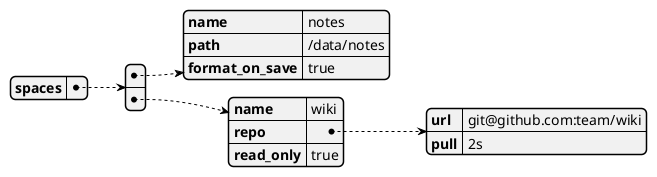
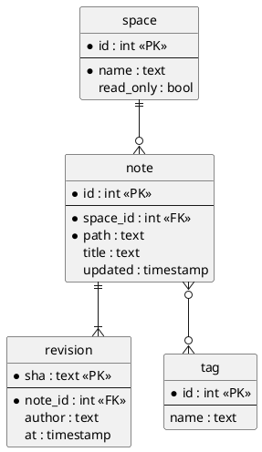
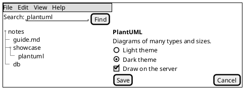
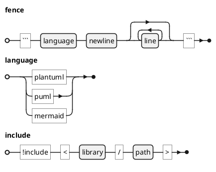
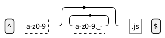

# Data and plans

## Mind map

```plantuml
@startmindmap
* scrawl
** Reading
*** Tree
*** Outline
*** Search
**** fuzzy
**** exact
**** regex
** Editing
*** Editor
*** Prettier
*** Pictures
left side
** Data
*** Markdown
*** History
*** Push
** Output
*** Export
*** Site
*** PDF
@endmindmap
```

## WBS

```plantuml
@startwbs
* PlantUML support
** Browser
*** Engine
*** Graphviz
*** Library
** Server
*** Worker process
*** Cache
*** Export budget
** Site
*** Engine script
*** Libraries
** Checks
*** Go tests
*** Playwright
*** Review
@endwbs
```

## Gantt chart

```plantuml
@startgantt
Project starts 2026-11-02
saturday are closed
sunday are closed
[Browser engine] as [B] lasts 3 days
[Library] as [L] lasts 2 days
[L] starts at [B]'s end
[Server] as [S] lasts 4 days
[S] starts at [B]'s end
[Site] lasts 2 days
[Site] starts at [L]'s end
[Review] as [R] lasts 3 days
[R] starts at [S]'s end
[Release] happens at [R]'s end
[S] is colored in LightBlue
@endgantt
```

## JSON

Small:

```plantuml
@startjson
{
  "name": "notes",
  "read_only": false
}
@endjson
```

Larger, with arrays and nested objects:

```plantuml
@startjson
{
  "space": {
    "name": "notes",
    "kind": "remote",
    "remote": {"url": "git@github.com:me/notes", "branch": "main", "pull": "2s"},
    "history": true
  },
  "unsynced": {"paths": ["db/locks.md", "guide.md"], "many": false},
  "users": [
    {"name": "admin", "role": "writer"},
    {"name": "bot", "role": "writer", "token": "***"},
    {"name": "reader", "role": "reader"}
  ],
  "limits": {"upload": "10MB", "render": "2MB", "timeouts": [5, 30, 60]}
}
@endjson
```

## YAML

```plantuml
@startyaml
spaces:
  - name: notes
    path: /data/notes
    format_on_save: true
  - name: wiki
    repo:
      url: git@github.com:team/wiki
      pull: 2s
    read_only: true
@endyaml
```

## ER

```plantuml
@startuml
hide circle
skinparam linetype ortho
entity "space" as space {
  *id : int <<PK>>
  --
  *name : text
  read_only : bool
}
entity "note" as note {
  *id : int <<PK>>
  --
  *space_id : int <<FK>>
  *path : text
  title : text
  updated : timestamp
}
entity "revision" as rev {
  *sha : text <<PK>>
  --
  *note_id : int <<FK>>
  author : text
  at : timestamp
}
entity "tag" as tag {
  *id : int <<PK>>
  --
  name : text
}
space ||--o{ note
note ||--|{ rev
note }o--o{ tag
@enduml
```

## UI mockup

```plantuml
@startsalt
{+
  {* File | Edit | View | Help }
  {
    Search: | "plantuml       " | [Find]
  }
  {T
    + notes
    ++ guide.md
    ++ showcase
    +++ plantuml
    ++ db
  } | {
    <b>PlantUML
    Diagrams of many types and sizes.
    ()  Light theme
    (X) Dark theme
    [X] Draw on the server
    [Save] | [Cancel]
  }
}
@endsalt
```

## EBNF

```plantuml
@startebnf
fence = "```", language, newline, { line }, "```" ;
language = "plantuml" | "puml" | "mermaid" ;
include = "!include", "<", library, "/", path, ">" ;
@endebnf
```

## Regular expression

```plantuml
@startregex
^[a-z0-9][a-z0-9._-]*\.js$
@endregex
```
